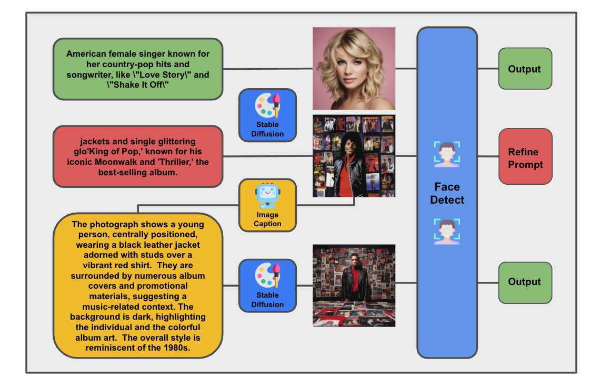

# MLCourse24



**Dependency**
- python == 3.9
- torch
- diffusers
- google-generativeai

```
unzip Celebrity_Image_Dataset.zip
```

use the llava+llama pipeline
```
python utils.py --llava_use --llama_use
```

use the gemini pipeline (set api key yourself)
```
python utils.py
```

evaluate results
```
python evaluate.py
```
